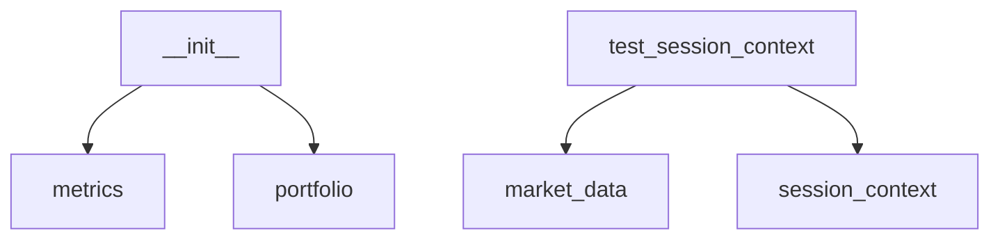

# Project Context

> **Auto-generated by [code-mapper](https://github.com/your-org/code-mapper).**  
> Read this file instead of scanning source files — it captures the full structure at a fraction of the token cost.
> `trading_core` · 10 files (python×10) · 15 classes · 19 functions · ~1,944 source lines

---
## File Structure

```
trading_core/
└── __init__.py
└── alpaca_broker.py
└── loss_guard.py
└── market_data.py
└── metrics.py
└── portfolio.py
└── regime_params.py
└── session_context.py
└── signal_strength.py
├── tests/
  └── test_session_context.py
```

## Class Diagram

```mermaid
classDiagram
    class AlpacaBroker["AlpacaBroker"] {
        +get_account_info()
        +get_positions()
        +get_position()
        +submit_market_order()
        +get_order()
        +get_open_orders()
        +close_position()
        ...
    }
    class LossGuard["LossGuard"] {
        +from_config()
        +record_loss()
        +record_win()
        +tick()
        +is_blocked()
        +get_streak()
        +get_cooloff_remaining()
        ...
    }
    class LossGuardConfig["«dataclass» LossGuardConfig"] {
        +enabled: bool
        +max_consecutive_losses: int
        +cooloff_bars: int
    }
    class Portfolio["Portfolio"] {
        +shares_held()
        +cost_basis()
        +holdings_value()
        +equity()
        +is_invested()
        +is_short()
        +open_position_count()
        ...
    }
    class RegimeAdjustments["«dataclass» RegimeAdjustments"] {
        +regime: str
        +regime_detected: bool
        +position_size_mult: float
        +entry_threshold_mult: float
    }
    class TestEarlySessionSizeScalar["TestEarlySessionSizeScalar"] {
        +test_premarket_0700_returns_1()
        +test_premarket_0900_returns_1()
        +test_open_0930_returns_scaled()
        +test_early_0945_returns_scaled()
        +test_early_0959_returns_scaled()
        +test_active_1000_returns_1()
        +test_active_1200_returns_1()
        ...
    }
    class TestFetchOhlcvSessionFilter["TestFetchOhlcvSessionFilter"] {
        +test_hourly_strips_pre_market_bars()
        +test_hourly_strips_after_hours_bars()
        +test_hourly_retains_regular_session_bars()
        +test_hourly_only_regular_input_unchanged_count()
        +test_daily_not_filtered()
        +test_columns_renamed_titlecase()
    }
    class TestIsExtendedTagging["TestIsExtendedTagging"] {
        +test_hourly_is_extended_false_for_regular_bars()
        +test_daily_is_extended_always_false()
        +test_fetch_ohlcv_extended_includes_all_bars()
        +test_fetch_ohlcv_extended_tags_premarket_as_extended()
        +test_fetch_ohlcv_extended_only_premarket()
        +test_fetch_ohlcv_extended_only_afterhours()
    }
    class TestIsRegularSessionBar["TestIsRegularSessionBar"] {
        +test_regular_open_930_is_regular()
        +test_midday_1300_is_regular()
        +test_last_regular_bar_1500_is_regular()
        +test_close_1600_is_extended()
        +test_premarket_0700_is_extended()
        +test_premarket_0930_boundary_is_regular()
        +test_afterhours_1800_is_extended()
    }
    class TestMeanReversionSignalStrengthIntegration["TestMeanReversionSignalStrengthIntegration"] {
        +test_active_hours_no_gap_strength_unmodified()
        +test_early_session_reduces_buy_strength()
        +test_confirming_gap_up_increases_buy_strength()
        +test_contrary_gap_down_reduces_buy_strength()
        +test_reason_chain_includes_pm_gap_annotation()
        +test_reason_chain_includes_early_session_annotation()
        +test_hold_signal_strength_always_zero()
    }
    class TestPremarketConfirmationMult["TestPremarketConfirmationMult"] {
        +test_gap_up_buy_signal_boost()
        +test_gap_up_sell_signal_penalty()
        +test_gap_up_short_signal_penalty()
        +test_gap_up_cover_signal_boost()
        +test_gap_down_buy_signal_penalty()
        +test_gap_down_sell_signal_boost()
        +test_gap_down_short_signal_boost()
        ...
    }
    class TestPremarketGapPct["TestPremarketGapPct"] {
        +test_gap_up_positive()
        +test_gap_down_negative()
        +test_no_premarket_bars_returns_none()
        +test_exception_returns_none()
        +test_market_metrics_has_premarket_gap_field()
        +test_market_metrics_premarket_gap_defaults_none()
    }
    class TestPremarketGapWarning["TestPremarketGapWarning"] {
        +test_large_gap_up_triggers_warning()
        +test_large_gap_down_triggers_warning()
        +test_small_gap_no_warning()
        +test_no_gap_no_warning()
        +test_exact_boundary_2pct_triggers_warning()
    }
    class Trade["«dataclass» Trade"] {
        +date: str
        +ticker: str
        +action: str
        +shares: int
    }
    class _TickerState["«dataclass» _TickerState"] {
        +consecutive_losses: int
        +cooloff_remaining: int
    }
```



## Module Dependencies



## Symbol Index


**`alpaca_broker.py`** `python`
- `class AlpacaBroker`  — Wrapper around Alpaca Trading API for execution and portfolio tracking.
  methods: `get_account_info`, `get_positions`, `get_position`, `submit_market_order`, `get_order`, `get_open_orders`, `close_position`

**`loss_guard.py`** `python`
> Consecutive loss guard — circuit-breaker for per-ticker losing streaks.
- `«dataclass» class _TickerState`  — Internal state for a single ticker.
- `«dataclass» class LossGuardConfig`  — Configuration for the loss guard.
- `class LossGuard`  — Per-ticker consecutive loss tracker with cool-off.
  methods: `from_config`, `record_loss`, `record_win`, `tick`, `is_blocked`, `get_streak`, `get_cooloff_remaining`, `reset`, +1 more

**`market_data.py`** `python`
> Historical price data fetch from the centralized Parquet Data Lake.
- `def fetch_ohlcv(ticker: str, lookback_days: int, interval: str) → DataFrame`  — Return OHLCV indexed by date (UTC-naive). Reads from local Parquet cache.
- `def fetch_ohlcv_extended(ticker: str, lookback_days: int) → DataFrame`  — Return ALL hourly bars (including pre/post-market) with an ``is_extended`` tag.
- `def fetch_risk_free_rate_annual(default: float) → float`  — Return annualized risk-free rate proxy (^IRX is quoted as % annualized).

**`metrics.py`** `python`
> Performance metrics for backtest results.
- `def total_return(equity: Series) → Optional`  — Total percentage return (e.g. 0.35 = +35%).
- `def cagr(equity: Series) → Optional`  — Compound annual growth rate.
- `def sharpe_ratio(equity: Series, rf_annual: float) → Optional`  — Annualised Sharpe ratio.
- `def sortino_ratio(equity: Series, rf_annual: float) → Optional`  — Annualised Sortino ratio (uses downside deviation only).
- `def max_drawdown(equity: Series) → float`  — Maximum peak-to-trough drawdown (negative float, e.g. -0.25 = -25%).
- `def calmar_ratio(equity: Series) → Optional`  — CAGR / abs(max drawdown).
- `def win_rate(trades_df: DataFrame) → Optional`  — Fraction of closed trades that were profitable.
- `def profit_factor(trades_df: DataFrame) → Optional`  — Gross profit / gross loss across all closed trades.
- `def avg_holding_days(trades_df: DataFrame) → Optional`  — Average number of calendar days between paired BUY and SELL trades.
- `def alpha_vs_benchmark(strategy_equity: Series, benchmark_equity: Series) → Optional`  — CAGR alpha of strategy over benchmark.
- `def compute_all_metrics(equity: Series, initial_capital: float, trades_df: DataFrame, benchmarks: Dict) → Dict`  — Compute and return all performance metrics as a flat dictionary.

**`portfolio.py`** `python`
> Simulated portfolio — tracks cash, positions, trades, and equity curve.
- `«dataclass» class Trade`  — Record of a single simulated trade.
- `class Portfolio`  — Cash + equity portfolio for backtesting.
  methods: `shares_held`, `cost_basis`, `holdings_value`, `equity`, `is_invested`, `is_short`, `open_position_count`, `long_notional`, +17 more

**`regime_params.py`** `python`
> Regime-adaptive parameter selection for trading strategies.
- `«dataclass» class RegimeAdjustments`  — Parameter adjustments to apply on top of a strategy's base config.
- `def get_regime_adjustments(strategy: str, regime_override: Optional, db_path: Optional) → RegimeAdjustments`  — Get regime-adaptive parameter adjustments for a strategy.

**`session_context.py`** `python`
> Session-context helpers for pre/post-market awareness.
- `def fetch_premarket_gap(ticker: str) → Optional`  — Return today's pre-market gap as a signed fraction (or None if unavailable).
- `def premarket_confirmation_mult(gap_pct: Optional, signal_direction: str, agree_boost: float, disagree_penalty: float) → float`  — Return a multiplier [0.85, 1.10] based on whether today's pre-market gap
- `def early_session_size_scalar(scale_down: float, early_minutes: int) → float`  — Return a position-size scalar < 1.0 if the current wall-clock time falls

**`signal_strength.py`** `python`
> Shared signal-strength saturation function (Master Spec § 10 S3).
- `def saturate(raw_strength: float) → float`  — Smoothly saturate a non-negative raw strength score into [0, 1).

**`tests\test_session_context.py`** `python`
> Tests for pre/post-market session handling across all three options.
- `class TestIsRegularSessionBar`
  methods: `test_regular_open_930_is_regular`, `test_midday_1300_is_regular`, `test_last_regular_bar_1500_is_regular`, `test_close_1600_is_extended`, `test_premarket_0700_is_extended`, `test_premarket_0930_boundary_is_regular`, `test_afterhours_1800_is_extended`
- `class TestFetchOhlcvSessionFilter`
  methods: `test_hourly_strips_pre_market_bars`, `test_hourly_strips_after_hours_bars`, `test_hourly_retains_regular_session_bars`, `test_hourly_only_regular_input_unchanged_count`, `test_daily_not_filtered`, `test_columns_renamed_titlecase`
- `class TestIsExtendedTagging`
  methods: `test_hourly_is_extended_false_for_regular_bars`, `test_daily_is_extended_always_false`, `test_fetch_ohlcv_extended_includes_all_bars`, `test_fetch_ohlcv_extended_tags_premarket_as_extended`, `test_fetch_ohlcv_extended_only_premarket`, `test_fetch_ohlcv_extended_only_afterhours`
- `class TestPremarketGapPct`
  methods: `test_gap_up_positive`, `test_gap_down_negative`, `test_no_premarket_bars_returns_none`, `test_exception_returns_none`, `test_market_metrics_has_premarket_gap_field`, `test_market_metrics_premarket_gap_defaults_none`
- `class TestPremarketGapWarning`
  methods: `test_large_gap_up_triggers_warning`, `test_large_gap_down_triggers_warning`, `test_small_gap_no_warning`, `test_no_gap_no_warning`, `test_exact_boundary_2pct_triggers_warning`
- `class TestPremarketConfirmationMult`
  methods: `test_gap_up_buy_signal_boost`, `test_gap_up_sell_signal_penalty`, `test_gap_up_short_signal_penalty`, `test_gap_up_cover_signal_boost`, `test_gap_down_buy_signal_penalty`, `test_gap_down_sell_signal_boost`, `test_gap_down_short_signal_boost`, `test_gap_down_cover_signal_penalty`, +5 more
- `class TestEarlySessionSizeScalar`
  methods: `test_premarket_0700_returns_1`, `test_premarket_0900_returns_1`, `test_open_0930_returns_scaled`, `test_early_0945_returns_scaled`, `test_early_0959_returns_scaled`, `test_active_1000_returns_1`, `test_active_1200_returns_1`, `test_active_1530_returns_1`, +4 more
- `class TestMeanReversionSignalStrengthIntegration`  — Verify that the session multipliers propagate through generate_signal().
  methods: `test_active_hours_no_gap_strength_unmodified`, `test_early_session_reduces_buy_strength`, `test_confirming_gap_up_increases_buy_strength`, `test_contrary_gap_down_reduces_buy_strength`, `test_reason_chain_includes_pm_gap_annotation`, `test_reason_chain_includes_early_session_annotation`, `test_hold_signal_strength_always_zero`